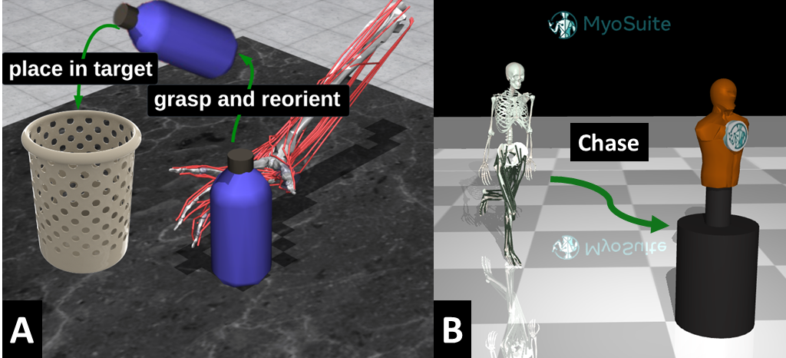

[](https://github.com/facebookresearch/myosuite)
[](https://myosuite.slack.com)
[](https://twitter.com/MyoSuite)

# 2023 NeurIPS - MyoChallenge

<p align="center">
  
  <p align="center"><i>MyoChallenge Tasks</i></p>
</p>

Welcome to the [**2023 NeurIPS - MyoChallenge:  Towards Human-Level Dexterity and Agility**](https://sites.google.com/view/myosuite/myochallenge/myochallenge-2023).

This challenge consists of developing controllers for a physiologically realistic musculoskeletal models to solve dexterous manipulation and locomotion tasks:

- A) **Manipulation task** Interact with an object and relocate it (`myoChallengeRelocateP1-v0`).

- B) **Locomotion/Chase-Tag task** Chase an opponent by controlling a high-dimensional bipedal model. (`myoChallengeChaseTagP1-v0`).


## Submission
We offer this year a simplified way of submitting solutions, based on GitHub actions, as well as the same process from the previous competition. Submission workflows are triggered automatically when new changes are pushed into your repository.

For those that are familiar with evalai-cli processes, submission can be done with the following steps. First install the [prerequisites](#Prerequisites) and then you can follow the 4 steps listed below to upload a solution in EvalAI.

``` bash
# Step 1 and 2 -- Train your model and personalize the agent evaluation script.
# Those steps can be skipped using the template agents e.g. agent/agent_mani_rotate.py, to test the submission system
## Test that agent agent communicate with environment
sh ./test/test_mani_agent.sh

# Step 3: Build the docker container
docker build -f docker/agent/Dockerfile_Mani . -t myochallengeeval_mani_agent

# Step 4: Upload your policy
evalai push myochallengeeval_mani_agent:latest --phase myochallenge2023-maniphase1-2105 --public

```

## Prerequisites
<details closed>
<summary>Install Docker compiler</summary>

Install docker following the [instructions](https://docs.docker.com/get-docker/). Once installed, you can compile the docker containers for the 2 agents with the following scripts:

Note: Do not use `sudo` privileges, rather manage Docker as a [non-root user](https://docs.docker.com/engine/install/linux-postinstall/). Building the docker with root privileges might cause problems during the evalai submission.
</details>

<details closed>
<summary>Register an account on EvalAI for the team</summary>

Install EvalAI Command Line Interface (*evalai-cli*)
```bash
pip install "evalai>=1.3.13"
```

You might need to install evalai dependencies first:

```bash
sudo apt-get install libxml2-dev libxslt-dev
```

[⚠️ IMPORTANT ⚠️] Each team needs to be registered to obtain a specific token to identify it (see [instructions](https://evalai.readthedocs.io/en/latest/participate.html)). After registration, it is possible to add the EvalAI account token to via evalai-cli (full list of commands [here](https://cli.eval.ai/)) with the following command:
``` bash
# Register the tocken to identify your contribution
evalai set_token <your EvalAI participant token>
# Test that the registration was successful. MyoChallenge needs to be in the list returned
evalai challenges --participant
```

</details>

<details closed>
<summary>Clone this repository </summary>

Clone this repository to have access to all needed files:
```bash
# Clone the repository
git clone https://github.com/MyoHub/myoChallenge2023Eval.git
# Enter into the root path
cd myoChallenge2023Eval
# Install dependencies and tests
source ./setup.sh
```
</details>

## STEP 1: Train your model
The API to interface with the environment is via [MyoSuite](https://github.com/facebookresearch/myosuite)).

More information on the training and customization are provided [here](./agent/TrainingPolicies.md)

<!-- For this challenge you might want to try the `myoChallengeManiP1-v0` for a quick test of training a policy (it should take ~2h on a regular laptop) and test the evaluation process. -->

## STEP 2: Customize Agent Script
We provide 2 templates to describe how the agent will communicate with the environment during the evaluation.
-  Manipulation script ([agent_mani.py](/agent/agent_mani.py))
-  Locomotion/Chase-Tag script ([agent_loco.py](/agent/agent_loco.py))

In both templates, you will need to (A) [import a policy](https://github.com/MyoHub/myoChallenge2023Eval/blob/challenge_2023/agent/agent_loco.py#L51) and (B) obtain [an action from each observation](https://github.com/MyoHub/myoChallenge2023Eval/blob/challenge_2023/agent/agent_loco.py#L72).
This is a policy trained with DEPRL for testing. It is important to customize this file to load the policy your have trained. It is also possible to add dependencies in the [requirements file](requirements/agent.txt).

A random policy is also provided for use: ([agent_random.py](/agent/agent_random.py))

Once you have finished customizing the scripts, testing between the agent and environment can be performed by using the scripts below:
- Manipulation `sh ./test/test_mani_agent.sh`
- Locomotion/Chase-Tag `sh ./test/test_loco_agent.sh`

Upon successful testing, it is possible to submit the solution following next steps.

## STEP 3: Build a docker container with the agent
The evaluation will be based on the model submitted as a docker container. It is possible to build the docker in two ways with either directly docker build (Suggested method) or with docker-compose (Alternative method, this will require to install [docker-compose](https://docs.docker.com/compose/install/))
<details open>
<summary>Suggested Method: Using `docker build`</summary>

``` bash
# Compile the container for the Manipulation Agent
docker build -f docker/agent/Dockerfile_Mani . -t myochallengeeval_mani_agent

# Compile the container for the Locomotion/ChaseTag Agent
docker build -f docker/agent/Dockerfile_Loco . -t myochallengeeval_loco_agent
```
</details>

<details close>
<summary>Alternative Method: Using `docker-compose`</summary>


``` bash
# Compile the container for the Mani Agent
docker-compose -f docker-compose-ManiAgent.yml up --build

# Compile the container for the Locomotion/Chase-Tag Agent
docker-compose -f docker-compose-LocoAgent.yml up --build
```
</br>
</details>

## Step 4: Upload the docker container on evalAI for evaluation

Push the docker image to [EvalAI docker registry](https://eval.ai/web/challenges/challenge-page/2105/submission) (it is possible to get the information about the image and TAG with the command `docker images`)

```bash
evalai push <image>:<tag> --phase <phase_name>
```
Use --private or --public flag in the submission command to make the submission private or public respectively.

for example, commands to upload agents for Phase 1 might look like:
- Manipultaion Agent : `evalai push myochallenge2023eval-die_agent:latest --phase myochallenge2023-maniphase1-2105 --public`

- Locomotion/Chase-Tag Agent: `evalai push myochallenge2023eval-loco_agent:latest --phase myochallenge2023-locophase1-2105 --public`

<!-- and, for Phase 2 might look like:

- Manipultaion Agent : `evalai push Dockerfile_Mani:latest --phase myochallenge2023-maniphase2-2105 --public`

- Locomotion/Chase-Tag Agent: `evalai push Dockerfile_Loco:latest --phase myochallenge2023-locophase2-2105 --public`
 -->

For more commands, please refer to [evalai-cli documentation](https://cli.eval.ai/) for additional commands.


### KNOWN ISSUES


If error to install `grpcio`, a solution is to install it manually

```bash
pip install grpcio
pip install grpcio-tools
```

It might be needed to make the path visible via:
```bash
export PYTHONPATH="./utils/:$PYTHONPATH"
export PYTHONPATH="./agent/:$PYTHONPATH"
```
