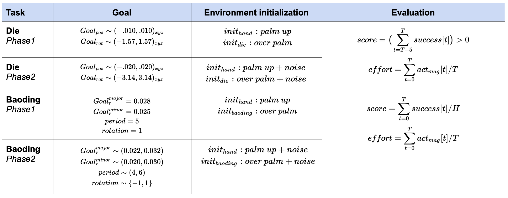

# Solve the tasks

## Interacting with the MyoChallenge environemtns
The challenges will consist of [two Phases](https://eval.ai/web/challenges/challenge-page/??????/phases), to which each a myosuite environemnt is associated to:

> Phase 1 - Die Environemnt: `myoChallengeManiP1-v0`
>
> Phase 1 -  Boading Ball Environemnt: `myoChallengeChaseTagP1-v1`

> Phase 2 - Die Environemnt: `myoChallengeManiP2-v0`
>
> Phase 2 - Boading Ball Environemnt: `myoChallengeChaseTagP1-v1`

To interact with the environements, you will need to install `myosuite` following those instructions:
``` bash
conda create --name myochallenge python=3.8
conda activate myochallenge
git clone https://github.com/facebookresearch/myosuite.git
cd myosuite
pip install -e .
export PYTHONPATH="./myosuite/:$PYTHONPATH"
```

It is possible to interact with the environemtn via a gym API:
``` python
import myosuite
import gym
env = gym.make('myoChallengeManiP1-v0')
env.reset()
for _ in range(1000):
  env.sim.render(mode='window')
  env.step(env.action_space.sample()) # take a random action
env.close()
```

## Training policies ([STEP 1](https://github.com/ET-BE/myoChallengeEval#step-2-customize-agent-script))
It is possible to interface the MyoChallenge environments with any machine learning framework compatible with the gym API.

## Customize Agent Script
Once the policy is trained, it is needed to be loaded in the specific agent to be submitted in the evaluation system ([STEP 2](https://github.com/ET-BE/myoChallengeEval#step-2-customize-agent-script)).

## Submit for evaluation and ranking on the evalAI dashboard
Follow [Step 3](https://github.com/ET-BE/myoChallengeEval#step-3-build-a-docker-container-with-the-agent) and [Step 4](https://github.com/ET-BE/myoChallengeEval#step-4-upload-the-docker-container-on-evalai-for-evaluation) for respectively building the docker container with the agent and uploading it to the evalAI evaluation system.


## Evaluation Criteria
The Dieve and Baoding ball environemnt in the two phases will have different goals, initializations, and evaluation metrices. Below a summary.
<p align="center">
  
  <p align="center"><i>Evaluation Criteria for the Die and Baoding ball environment in the two phase.</i></p>
</p>


## TIP: Personalization of Reward
One method to improve the performance is the reward shaping. It is possible to customize the reward function by modifing the `get_reward` function in the specific environment e.g. for the [die environment](https://github.com/facebookresearch/myosuite/blob/e3b7d6ebf84ba8f0be7ebf0929e2702b64580b5d/myosuite/envs/myo/myochallenge/reorient_v0.py#L73) or for the [baoding ball](https://github.com/facebookresearch/myosuite/blob/e3b7d6ebf84ba8f0be7ebf0929e2702b64580b5d/myosuite/envs/myo/myochallenge/baoding_v1.py#L143)
